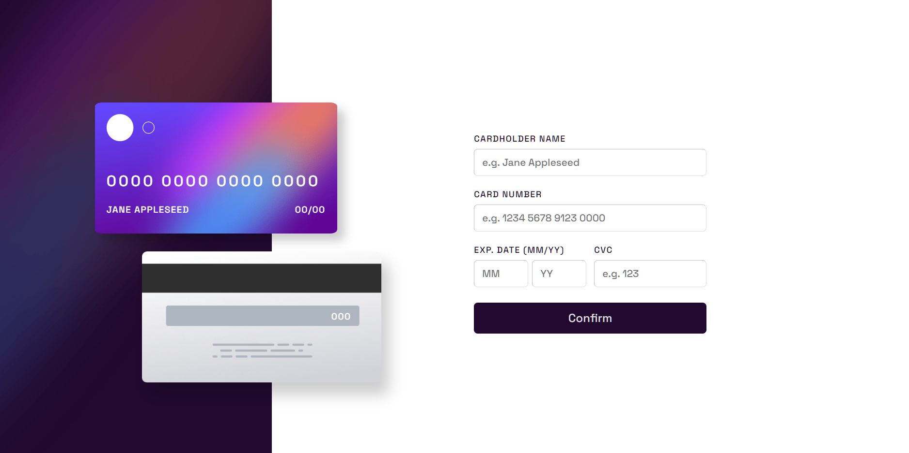

# Frontend Mentor - Interactive card details form solution

This is a solution to the [Interactive card details form challenge on Frontend Mentor](https://www.frontendmentor.io/challenges/interactive-card-details-form-XpS8cKZDWw). Frontend Mentor challenges help you improve your coding skills by building realistic projects. 

## Table of contents

- [Overview](#overview)
  - [The challenge](#the-challenge)
  - [Screenshot](#screenshot)
  - [Links](#links)
- [My process](#my-process)
  - [Built with](#built-with)
  - [What I learned](#what-i-learned)
  - [Continued development](#continued-development)
  - [Useful resources](#useful-resources)
- [Author](#author)

## Overview

### The challenge

Users should be able to:

- Fill in the form and see the card details update in real-time
- Receive error messages when the form is submitted if:
  - Any input field is empty
  - The card number, expiry date, or CVC fields are in the wrong format
- View the optimal layout depending on their device's screen size
- See hover, active, and focus states for interactive elements on the page

### Screenshot

### Links

- Solution URL: [Github](https://github.com/DiaKarti/Interactive-card-details-form/)
- Live Site URL: [Netlify](https://chic-kelpie-4237f8.netlify.app/)

## My process

### Built with

- Semantic HTML5 markup
- CSS custom properties
- Flexbox
- CSS Grid
- Mobile-first workflow
- Vanilla JS

### What I learned

By far I what I found to be the hardest thing thing in this challenge was styling the two cards to appear good in most screen sizes, which required media queries, CSS grid and a heafty dose of the CSS "clamp()" function. And overall, I think I didn't do half bad in replicating the original design.
Implementing an appropriate form validation took most of the dev time (even though I know client-side validation is practically usseless in an actual site), but I think it was worth it.

### Continued development

Following the completion of this project, I would like to focus on making full sites from scratch, as that appears to me to be the next logical conclusion.

### Useful resources

- [DevDocs](https://devdocs.io) - This is hands down one of the best resources for an aspiring web dev; ton of documentation for a plethora of languages and especially useful for people who forget their syntax, like me.

## Author

- Frontend Mentor - [@DiaKarti](https://www.frontendmentor.io/profile/DiaKarti)
